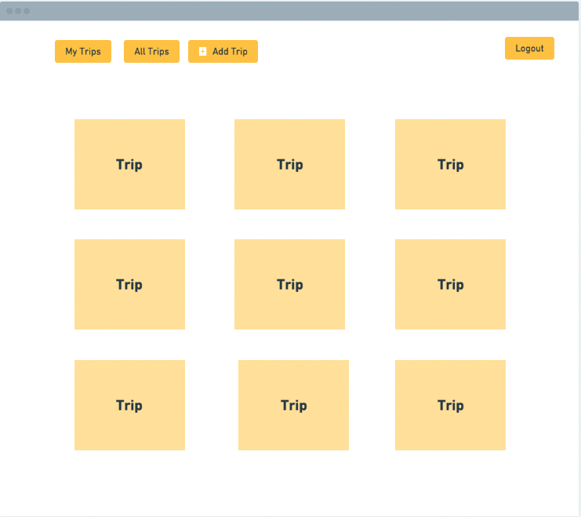
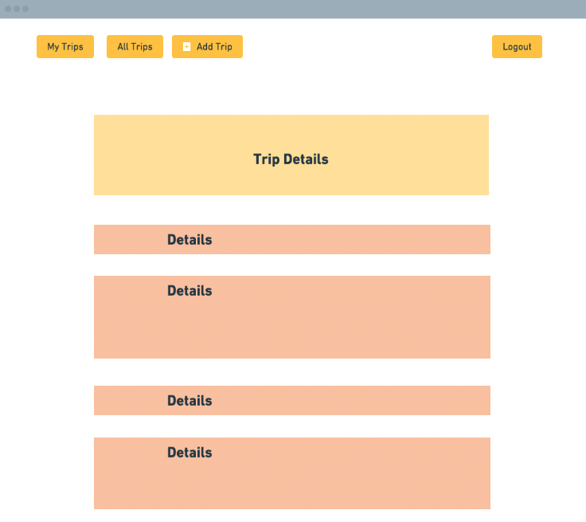
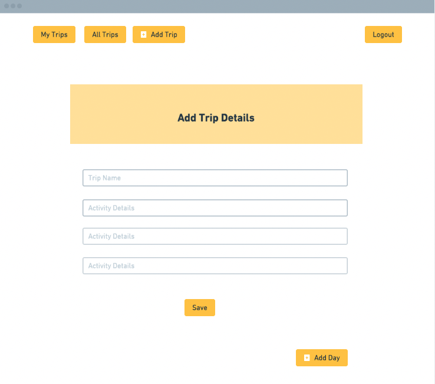
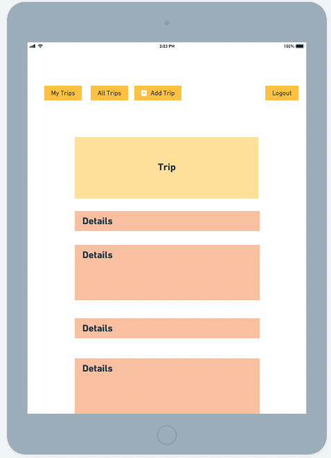
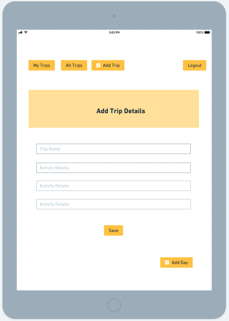
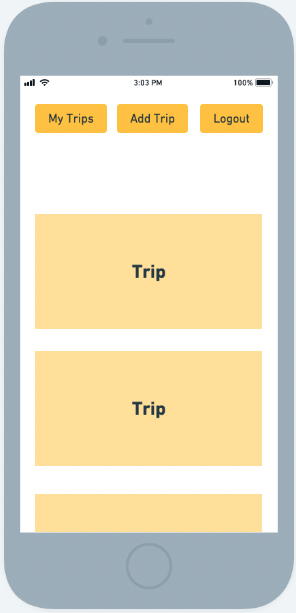
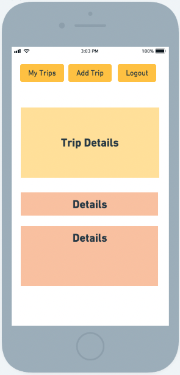
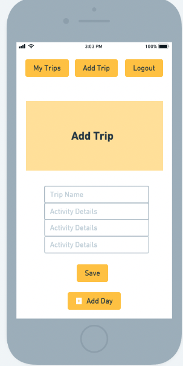
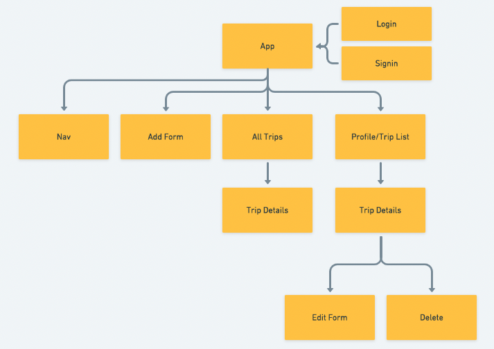
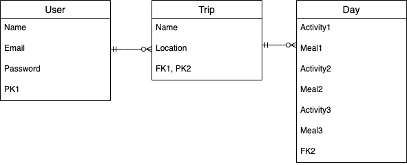

# weTinerary

- [Overview](#overview)
- [MVP](#mvp)
  - [Goals](#goals)
  - [Libraries and Dependencies](#libraries-and-dependencies)
  - [Client (Front End)](#client-front-end)
    - [Wireframes](#wireframes)
    - [Component Tree](#component-tree)
    - [Component Architecture](#component-architecture)
    - [Time Estimates](#time-estimates)
  - [Server (Back End)](#server-back-end)
    - [ERD Model](#erd-model)
- [Post-MVP](#post-mvp)
- [Code Showcase](#code-showcase)
- [Code Issues & Resolutions](#code-issues--resolutions)

<br>

## Overview

**weTinerary** is a trip itinerary application. Users can create an account, users can add their trip details, and users can see other users trips

<br>

## MVP
- users can create an account
- users can create, edit, delete trips
- users can view other users trips 
- responsive CSS design

<br>

### Goals

- become familiar with Ruby and Rails
- smooth integration of front and back-end

<br>

### Libraries and Dependencies

|     Item      | Role                               |
| :-------------- | :----------------------------------------- |
|      React       | front-end|
|   React Router   | front-end routing |
|   Ruby on Rails  | back-end |
|      Devise      | user auth |
|      Axios       | handle requests |

<br>

### Client (Front End)

#### Wireframes
[Link to Wireframe](https://whimsical.com/wetinerary-wxBMkYpsZxKKCVFWXgtYh)













#### Component Tree

[Component Tree](https://whimsical.com/VE1HrMyfLYez38YKWj4Hij)


#### Component Architecture

``` structure

src
|__ components/
      |__ Nav/
            |__ Nav.jsx
            |__ Nav.css
      |__ Trips.jsx
            |__ Trips/
            |__ Trips.css
      |__ TripDetails
            |__TripDetails.jsx
            |__TripDetails.css
      |__ Profile/
            |__Profile.jsx
            |__Profile.css
      |__ AddTrip/
            |__AddTrip.jsx
            |__AddTrip.css
      |__ EditTrip
            |__EditTrip.jsx
            |__EditTrip.css
      |__ DeleteTrip/
            |__DeleteTrip.jsx
            |__DeleteTrip.css
      |__ Signup/
            |__Signup.jsx
            |__Signup.css
      |__ Login/
            |__Login.jsx
            |__Login.css
|__ services/
    |__ api.js
    |__ user.js
    |__ trip.js
|__app.js
|__app.css
|__index.js
```

#### Time Estimates

| Task                | Priority | Estimated Time | Time Invested | Actual Time |
| ------------------- | :------: | :------------: | :-----------: | :---------: |
| Styling             |    L     |     6      |     TBD     |    TBD    |
| Build profile       |    H     |     3      |     TBD     |    TBD    |
| Signup Form         |    H     |     3      |     TBD     |    TBD    |
| Login Form          |    H     |     3      |     TBD     |    TBD    |
| Add Trip Form       |    H     |     3      |     TBD     |    TBD    |
| Edit Form           |    H     |     3      |     TBD     |    TBD    |
| Delete Form         |    H     |     3      |     TBD     |    TBD    |
| Build CRUD Actions  |    H     |     6      |     TBD     |    TBD    |
| TOTAL               |          |     30     |     TBD     |    TBD    |

<br>

### Server (Back End)

#### ERD Model


<br>

***

## Post-MVP

- make a trip private or public
- choose to add dates (will be private for privacy reasons)
- ability for multiple users to modify a trip (for group trips)
- users can add comments to their trip to give viewers more information
- users can "follow" a user 
- users can see all trips from a specific user

***

## Code Showcase

> Use this section to include a brief code snippet of functionality that you are proud of and a brief description.
TBD

## Code Issues & Resolutions

> Use this section to list of all major issues encountered and their resolution.
TBD